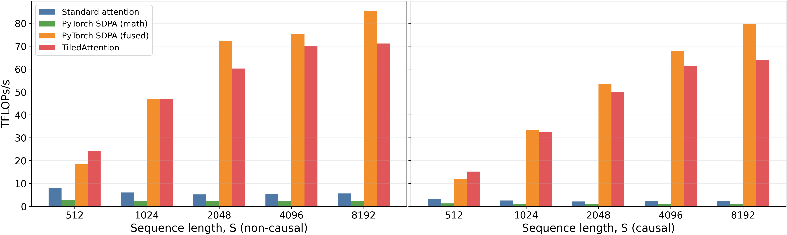
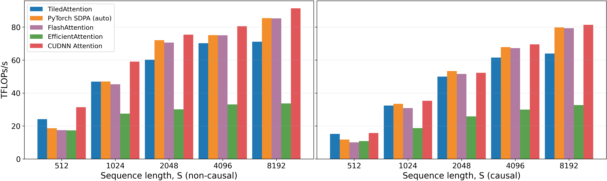
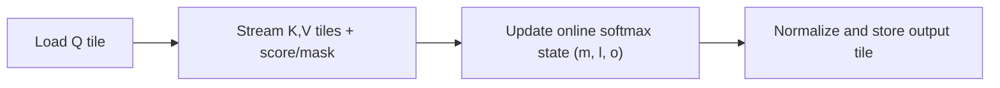

# TiledAttention

Paper artifact and reference implementation for:

>**TiledAttention: a CUDA Tile SDPA Kernel for PyTorch**

>Author: Taimur Khan (taimur.khan@ufz.de)

>Paper: [](https://doi.org/10.48550/arXiv.2603.01960)


>Results & logs: [](https://doi.org/10.5281/zenodo.18787737)







## Abstract
*_TiledAttention_* is a scaled dot-product attention (SDPA) forward operator for SDPA research on NVIDIA GPUs. Implemented in cuTile Python (TileIR) and exposed as a PyTorch-callable function, it is easier to modify than low-level CUDA templates while retaining realistic behavior via online softmax and tiled $K,V$ streaming. The approach is both performant and directly editable at the schedule level from Python (tile shapes, staging, shared-memory layout), enabling rapid, reproducible kernel research without template-heavy CUDA/CUTLASS rewrites. We benchmark
TiledAttention on an NVIDIA DGX GB10 node with a reproducible harness and compare against PyTorch SDPA (auto-dispatch) and explicit unfused baselines across sequence length, head dimension, and precision (FP16/BF16). While production fused baselines remain stronger overall,
TiledAttention delivers large speedups over standard eager attention paths and is available for direct use within PyTorch workflows, providing a practical balance between performance and customizability.


## Workflow Diagram


## What This Repo Contains
- SDPA API: `sdpa(q, k, v, causal=False, scale=None) -> o`
- cuTile forward kernels:
  - tiled streaming over `K/V`
  - online softmax (`m`, `l`, `o` running state)
  - no `S x S` score materialization
- compile cache:
  - in-memory and disk-backed helpers in `src/tiledattention/kernels/compile_cache.py`
- reproducible study + profiling scripts:
  - `benchmark-gb10/run_study.py`
  - `benchmark-gb10/run_ncu_profile.py`

## Strict Requirements

### Hardware
- NVIDIA GPU with Blackwell-class capability supported by this repo runtime checks (`10.x` or `12.x`).
- CUDA 13.1 + must for `cuda-tile` library.

### Software
- Linux
- Python `>=3.10`
- NVIDIA driver compatible with CUDA 13.x
- CUDA Toolkit `13.1+` with:
  - `nvcc`
  - `tileiras`
  - `ncu` (for Nsight Compute runs)
  - `nsys` (optional, for Nsight Systems traces)

### Python stack used for the paper artifact
- `torch==2.10.0+cu130`
- `torchvision==0.25.0+cu130`
- `cupy-cuda13x==13.6.0`
- `cuda-tile==1.1.0`
- `matplotlib` (figure generation)

## Strict Installation Guide

```bash
cd TiledAttention

python3 -m venv .venv
source .venv/bin/activate

python -m pip install --upgrade pip setuptools wheel

# Install from requirements.txt (single source of dependency truth)
pip install -r requirements.txt

# Install project in editable mode
pip install -e . --no-build-isolation
```

## HF Kernel Sync Workflow
For Hugging Face kernel builds, `src/tiledattention` is the single source of truth.
Do not edit `torch-ext/tiledattention` manually; it is a build mirror used by `kernel-builder`.

Before any `kernel-builder build` or `build-and-upload`, run:

```bash
python scripts/sync_torch_ext_from_src.py
```

Recommended sequence:

```bash
python scripts/sync_torch_ext_from_src.py
kernel-builder build --variant torch211-cxx11-cu130-aarch64-linux -L .
kernel-builder testshell --variant torch211-cxx11-cu130-aarch64-linux .
```

## Dependency Validation (Fail Fast)
Run this before benchmarking:

```bash
python - <<'PY'
import shutil
import torch, cupy, cuda.tile as ct

print("torch:", torch.__version__, "torch.cuda:", torch.version.cuda)
print("cupy:", cupy.__version__)
print("cuda.tile:", ct.__version__)
print("cuda available:", torch.cuda.is_available())
if torch.cuda.is_available():
    print("device:", torch.cuda.get_device_name(0))
    print("capability:", torch.cuda.get_device_capability(0))

for cmd in ("nvcc", "tileiras"):
    print(cmd, "->", shutil.which(cmd))
PY
```

## Quickstart
```python
import torch
from tiledattention import sdpa

q = torch.randn(1, 2, 64, 64, device="cuda", dtype=torch.float16)
k = torch.randn(1, 2, 64, 64, device="cuda", dtype=torch.float16)
v = torch.randn(1, 2, 64, 64, device="cuda", dtype=torch.float16)

o = sdpa(q, k, v, causal=True)
print(o.shape, o.dtype)
```

## Reproduce Paper Study Outputs

```bash
# Optional cleanup
rm -rf benchmark-gb10/results benchmark-gb10/figures
mkdir -p benchmark-gb10/results benchmark-gb10/figures

# Recommended paper run configuration
export TILEDATTN_SYNC_MODE=async
export TILEDATTN_TILE_M=64
export TILEDATTN_TILE_N=64
export TILEDATTN_ACCUM_MODE=fp32

python benchmark-gb10/run_study.py --warmup 5 --iters 15 --batch 1 --heads 8 --disable-flashattention
```

Outputs:
- `benchmark-gb10/results/benchmark_results.csv`
- `benchmark-gb10/results/tuning_results.csv`
- `benchmark-gb10/results/table3_reproducibility.md`
- `benchmark-gb10/results/table4_tiling_sensitivity.md`
- `benchmark-gb10/results/study_summary.md`
- `benchmark-gb10/figures/figure3_throughput_vs_s.png`
- `benchmark-gb10/figures/figure4_regime_map.png`
- `benchmark-gb10/figures/figure5_bw_proxy.png`
- `benchmark-gb10/figures/figure_fa_style_tflops_fp16.png`
- `benchmark-gb10/figures/figure6_explicit_baselines_tflops_fp16.png`

## Nsight Compute (Submission-Ready Profiling)

Recommended focused profiles:

```bash
# Non-causal, D=128
sudo -E TiledAttention/.venv/bin/python \
  benchmark-gb10/run_ncu_profile.py \
  --ncu-path /usr/local/cuda/bin/ncu \
  --output-dir benchmark-gb10/results \
  --batch 1 --heads 8 --seq-len 4096 --head-dim 128 \
  --dtype float16 --accum-mode fp32 --warmup 5 --repeats 1 \
  --sync-mode async --tile-m 64 --tile-n 64

# Causal, D=128
sudo -E TiledAttention/.venv/bin/python \
  benchmark-gb10/run_ncu_profile.py \
  --ncu-path /usr/local/cuda/bin/ncu \
  --output-dir benchmark-gb10/results \
  --batch 1 --heads 8 --seq-len 4096 --head-dim 128 \
  --dtype float16 --accum-mode fp32 --causal --warmup 5 --repeats 1 \
  --sync-mode async --tile-m 64 --tile-n 64

# Non-causal stress point, D=64
sudo -E TiledAttention/.venv/bin/python \
  benchmark-gb10/run_ncu_profile.py \
  --ncu-path /usr/local/cuda/bin/ncu \
  --output-dir benchmark-gb10/results \
  --batch 1 --heads 8 --seq-len 2048 --head-dim 64 \
  --dtype float16 --accum-mode fp32 --warmup 5 --repeats 1 \
  --sync-mode async --tile-m 64 --tile-n 64
```

Nsight artifacts:
- `.ncu-rep` reports
- raw CSV exports (`*_raw.csv`)
- summary markdown (`ncu_profile_summary_*.md`)

## Runtime Tuning Controls
- `TILEDATTN_SYNC_MODE` = `async | post | strict`
- `TILEDATTN_ACCUM_MODE` = `auto | fp32 | fp16`
- `TILEDATTN_TILE_M`, `TILEDATTN_TILE_N`
- `TILEDATTN_KERNEL_OPT_LEVEL`
- `TILEDATTN_KERNEL_OCCUPANCY`
- `TILEDATTN_KERNEL_NUM_CTAS`
- `TILEDATTN_CHUNKED_HEAD_DIMS` (experimental)
- `TILEDATTN_DISABLE_ALIGNED_FASTPATH` (debug/ablation)

## Strict Notes
- If Nsight is run with `sudo`, output files may be owned by `root`. Fix ownership:
  - `sudo chown -R $USER:$USER benchmark-gb10/results`
- PyTorch `cu130` with host CUDA `13.1` can emit a minor-version warning; this is expected in this setup.
- This repository currently targets forward-pass SDPA only.

## License
Apache-2.0. See [LICENSE](LICENSE).
